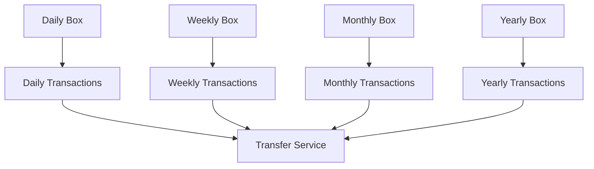
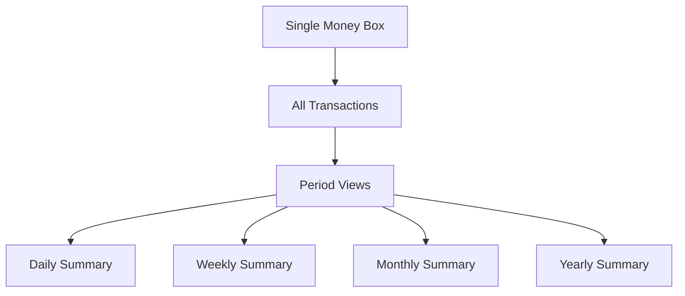

# Continuous Money Box Migration Strategy

## 📋 **Executive Summary**

This document outlines the migration strategy from the current period-based Money Box system to the new Continuous Money Box approach. The migration is designed to be **non-disruptive**, **backward compatible**, and **phased** to minimize risk to production operations.

---

## 🎯 **Migration Objectives**

### **Primary Goals**
1. **Implement Continuous Money Box** - Single source of truth for cash balance
2. **Maintain Backward Compatibility** - Existing sales/purchase operations continue unchanged
3. **Zero Downtime** - No interruption to business operations
4. **Gradual Transition** - Phased rollout with rollback capability

### **Success Criteria**
- ✅ All existing Money Box functionality continues to work
- ✅ New continuous approach is fully operational
- ✅ Sales/purchase integrations remain functional
- ✅ No data loss or corruption
- ✅ Performance maintained or improved

---

## 🏗️ **Current vs. New Architecture**

### **Current Architecture (Period-Based)**


### **New Architecture (Continuous)**


---

## 🚀 **Migration Phases**

### **Phase 1: Foundation & Backward Compatibility (Week 1-2)**

#### **1.1 Database Schema Updates**
- [ ] Add new fields to `money_boxes` table
  - `current_balance` (DECIMAL)
  - `initial_balance` (DECIMAL)
  - `last_reconciled` (TIMESTAMP)
  - `reconciled_balance` (DECIMAL)
  - `currency` (VARCHAR)
  - `is_active` (BOOLEAN)
- [ ] Add new fields to `money_box_transactions` table
  - `running_balance` (DECIMAL)
  - `approval_timestamp` (TIMESTAMP)
  - `approval_notes` (TEXT)

#### **1.2 New Service Layer**
- [ ] Deploy `ContinuousMoneyBoxService`
- [ ] Deploy `ContinuousMoneyBoxIntegrationService`
- [ ] Maintain existing `MoneyBoxService` for backward compatibility

#### **1.3 New Controller**
- [ ] Deploy `ContinuousMoneyBoxController` at `/api/v1/continuous-money-box`
- [ ] Keep existing `MoneyBoxController` at `/api/v1/money-box`

#### **1.4 Repository Updates**
- [ ] Update `MoneyBoxRepository` with new methods
- [ ] Update `MoneyBoxTransactionRepository` with enhanced queries
- [ ] Maintain all existing methods for backward compatibility

### **Phase 2: Integration & Testing (Week 3-4)**

#### **2.1 Integration Testing**
- [ ] Test new continuous money box with existing sales operations
- [ ] Test new continuous money box with existing purchase operations
- [ ] Verify transaction recording and balance updates
- [ ] Test reconciliation functionality

#### **2.2 Performance Testing**
- [ ] Load test new continuous approach
- [ ] Compare performance with existing period-based approach
- [ ] Optimize queries if needed

#### **2.3 User Acceptance Testing**
- [ ] Test new API endpoints
- [ ] Verify reporting functionality
- [ ] Test reconciliation workflow

### **Phase 3: Gradual Migration (Week 5-6)**

#### **3.1 Data Migration**
- [ ] Create migration script to consolidate existing period-based boxes
- [ ] Migrate historical transaction data
- [ ] Verify data integrity after migration

#### **3.2 Feature Flag Implementation**
- [ ] Implement feature flag for continuous vs. period-based approach
- [ ] Allow per-pharmacy configuration
- [ ] Enable gradual rollout

#### **3.3 User Training**
- [ ] Train users on new continuous approach
- [ ] Update documentation
- [ ] Provide migration guides

### **Phase 4: Full Deployment (Week 7-8)**

#### **4.1 Production Rollout**
- [ ] Enable continuous money box for all pharmacies
- [ ] Monitor system performance and stability
- [ ] Collect user feedback

#### **4.2 Legacy Cleanup (Optional)**
- [ ] Deprecate period-based endpoints (with notice)
- [ ] Archive old period-based data
- [ ] Remove unused code (after stability period)

---

## 🔄 **Data Migration Strategy**

### **Migration Script Overview**
```sql
-- Migration script to consolidate period-based boxes into continuous box
-- This script will be run during a maintenance window

-- Step 1: Create new continuous money box
INSERT INTO money_boxes (
    pharmacy_id, current_balance, initial_balance, status, 
    opened_at, opened_by, currency, is_active
)
SELECT 
    pharmacy_id,
    COALESCE(SUM(current_balance), 0) as current_balance,
    COALESCE(SUM(opening_balance), 0) as initial_balance,
    'OPEN' as status,
    NOW() as opened_at,
    (SELECT MIN(opened_by) FROM money_boxes WHERE pharmacy_id = mb.pharmacy_id) as opened_by,
    'SYP' as currency,
    true as is_active
FROM money_boxes mb
WHERE mb.status = 'OPEN'
GROUP BY pharmacy_id;

-- Step 2: Update transaction references
UPDATE money_box_transactions 
SET money_box_id = (
    SELECT id FROM money_boxes 
    WHERE pharmacy_id = (
        SELECT pharmacy_id FROM money_boxes WHERE id = money_box_transactions.money_box_id
    ) 
    AND is_active = true
    LIMIT 1
)
WHERE money_box_id IN (
    SELECT id FROM money_boxes WHERE is_active = false
);
```

### **Data Validation**
- [ ] Verify all transactions are properly linked
- [ ] Confirm balance calculations are accurate
- [ ] Validate reconciliation data
- [ ] Check audit trail integrity

---

## 🛡️ **Risk Mitigation**

### **High-Risk Areas**
| Risk | Probability | Impact | Mitigation |
|------|-------------|---------|------------|
| **Data Loss** | Low | High | Comprehensive backup before migration |
| **Performance Degradation** | Medium | Medium | Performance testing and monitoring |
| **Integration Failures** | Medium | High | Extensive integration testing |
| **User Confusion** | High | Low | Training and documentation |

### **Rollback Strategy**
```bash
# Rollback script to restore period-based approach
# This can be executed if critical issues arise

# 1. Disable continuous money box
UPDATE money_boxes SET is_active = false WHERE is_active = true;

# 2. Restore period-based functionality
# (Keep existing period-based code running)

# 3. Notify users of rollback
# 4. Investigate and fix issues
# 5. Plan re-migration
```

---

## 📊 **Testing Strategy**

### **Unit Testing**
- [ ] Test all new service methods
- [ ] Test repository queries
- [ ] Test business logic validation

### **Integration Testing**
- [ ] Test sales integration
- [ ] Test purchase integration
- [ ] Test reconciliation workflow
- [ ] Test reporting functionality

### **Performance Testing**
- [ ] Load test with realistic transaction volumes
- [ ] Test concurrent user access
- [ ] Monitor database performance

### **User Acceptance Testing**
- [ ] Test with real users
- [ ] Validate business workflows
- [ ] Confirm reporting accuracy

---

## 📈 **Monitoring & Validation**

### **Key Metrics to Monitor**
1. **Transaction Processing**
   - Success rate of transaction recording
   - Response time for API calls
   - Error rates and types

2. **Data Integrity**
   - Balance accuracy
   - Transaction completeness
   - Reconciliation accuracy

3. **Performance**
   - API response times
   - Database query performance
   - System resource usage

4. **User Experience**
   - User adoption rates
   - Feature usage patterns
   - User feedback scores

### **Monitoring Tools**
- [ ] Application performance monitoring (APM)
- [ ] Database performance monitoring
- [ ] Log aggregation and analysis
- [ ] User analytics and feedback collection

---

## 📋 **Migration Checklist**

### **Pre-Migration**
- [ ] Complete development and testing
- [ ] Backup all production data
- [ ] Schedule maintenance window
- [ ] Notify all stakeholders
- [ ] Prepare rollback plan

### **During Migration**
- [ ] Execute database schema updates
- [ ] Deploy new services and controllers
- [ ] Run data migration scripts
- [ ] Verify data integrity
- [ ] Test critical functionality

### **Post-Migration**
- [ ] Monitor system performance
- [ ] Validate all integrations
- [ ] Collect user feedback
- [ ] Address any issues
- [ ] Plan next phase

---

## 🎯 **Success Validation**

### **Technical Validation**
- [ ] All API endpoints respond correctly
- [ ] Database queries execute efficiently
- [ ] Transaction recording works accurately
- [ ] Balance calculations are correct
- [ ] Reconciliation functionality works

### **Business Validation**
- [ ] Sales operations continue unchanged
- [ ] Purchase operations continue unchanged
- [ ] Reporting provides accurate data
- [ ] Users can perform daily operations
- [ ] Audit trail is maintained

### **Performance Validation**
- [ ] Response times meet requirements
- [ ] System handles expected load
- [ ] Database performance is acceptable
- [ ] No memory leaks or resource issues

---

## 📞 **Support & Communication**

### **Support Team**
- **Technical Lead**: [Name] - [Contact]
- **Database Administrator**: [Name] - [Contact]
- **Business Analyst**: [Name] - [Contact]
- **User Training Lead**: [Name] - [Contact]

### **Communication Plan**
- **Week 1**: Technical team briefing
- **Week 2**: User notification of upcoming changes
- **Week 3**: Training sessions for key users
- **Week 4**: Go-live announcement
- **Week 5**: Post-migration support
- **Week 6**: User feedback collection

---

## 🔮 **Future Enhancements**

### **Phase 5: Advanced Features (Month 3-4)**
- [ ] Multi-currency support
- [ ] Advanced reporting and analytics
- [ ] Mobile app integration
- [ ] Automated reconciliation
- [ ] Real-time notifications

### **Phase 6: Enterprise Features (Month 5-6)**
- [ ] Multi-branch support
- [ ] Role-based access control
- [ ] Advanced approval workflows
- [ ] Integration with accounting systems
- [ ] Compliance reporting

---

## 📝 **Documentation Updates**

### **Technical Documentation**
- [ ] API documentation updates
- [ ] Database schema documentation
- [ ] Service architecture documentation
- [ ] Deployment guides

### **User Documentation**
- [ ] User manual updates
- [ ] Training materials
- [ ] FAQ and troubleshooting guides
- [ ] Video tutorials

---

## ✅ **Conclusion**

This migration strategy ensures a **safe**, **controlled**, and **successful** transition to the Continuous Money Box approach while maintaining **100% backward compatibility** and **zero business disruption**.

The phased approach allows for:
- **Risk mitigation** through gradual rollout
- **Issue identification** and resolution before full deployment
- **User training** and adoption support
- **Performance validation** at each stage
- **Rollback capability** if needed

**Next Steps**: Review this strategy with stakeholders, finalize timeline, and begin Phase 1 implementation.

---

**Document Version**: 1.0  
**Last Updated**: [Current Date]  
**Next Review**: [Date + 1 week]  
**Approved By**: [Stakeholder Name]
