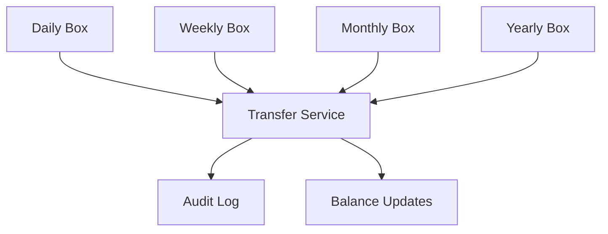
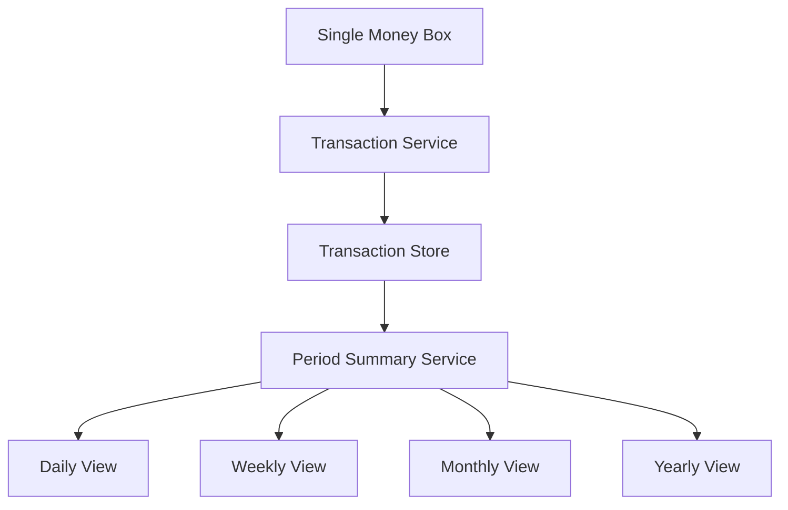

# Money Box Feature - Architectural Decision Document

## 📋 **Executive Summary**

This document presents the architectural analysis for implementing the Money Box feature in the Teryaq Pharmacy Management System. Two implementation approaches are analyzed: **Multiple Boxes with Transfers** and **Continuous Single Box**. The document provides technical analysis, business impact assessment, and recommendations to support senior stakeholder decision-making.

---

## 🎯 **Decision Context**

### **Business Objective**
Implement a comprehensive money management system for pharmacy cash operations, supporting daily cash management, financial reporting, and audit compliance.

### **Stakeholders**
- **CTO/VP Engineering**: Technical implementation decision
- **Product Manager**: Feature scope and business requirements
- **System Architect**: Technical architecture and design
- **Business Analyst**: Business process alignment
- **DevOps/Infrastructure**: Deployment and operational considerations

### **Decision Deadline**
*[To be determined by project timeline]*

---

## 🏗️ **Option 1: Multiple Boxes with Transfers**

### **Architecture Overview**


### **Technical Implementation**

#### **Database Schema**
```sql
-- Multiple money boxes
CREATE TABLE money_box (
    id BIGINT PRIMARY KEY,
    pharmacy_id BIGINT,
    period_type VARCHAR(20), -- DAILY, WEEKLY, MONTHLY, YEARLY
    business_date DATE,
    opening_balance DECIMAL(15,2),
    current_balance DECIMAL(15,2),
    status VARCHAR(20),
    created_at TIMESTAMP
);

-- Transfer management
CREATE TABLE money_box_transfer (
    id BIGINT PRIMARY KEY,
    from_box_id BIGINT,
    to_box_id BIGINT,
    amount DECIMAL(15,2),
    currency VARCHAR(3),
    status VARCHAR(20),
    approval_notes TEXT,
    approved_by BIGINT,
    transfer_date TIMESTAMP
);
```

#### **Service Layer**
```java
@Service
public class MoneyBoxTransferService {
    
    @Transactional
    public MoneyBoxTransfer initiateTransfer(TransferRequest request) {
        // Validate source and destination boxes
        // Check transfer limits and permissions
        // Create transfer record with PENDING status
        // Trigger approval workflow
    }
    
    @Transactional
    public void approveTransfer(Long transferId, String approvalNotes) {
        // Verify approver permissions
        // Execute the transfer
        // Update both box balances
        // Log audit trail
    }
    
    @Transactional
    public void rejectTransfer(Long transferId, String rejectionReason) {
        // Mark transfer as rejected
        // Notify initiator
        // Log rejection reason
    }
}
```

### **Business Use Cases**

#### **1. Multi-Branch Operations**
- **Scenario**: Central pharmacy with multiple branches
- **Benefit**: Each branch manages independent cash flow
- **Implementation**: Separate money boxes per branch per period

#### **2. Department-Based Budgeting**
- **Scenario**: Different departments (cashier, manager, owner) manage different cash pools
- **Benefit**: Prevent overspending in specific areas
- **Implementation**: Role-based access to specific boxes

#### **3. Multi-Currency Management**
- **Scenario**: Operations in multiple currencies (SYP, USD, EUR)
- **Benefit**: Currency isolation and exchange rate management
- **Implementation**: Separate boxes per currency

### **Technical Benefits**
- ✅ **Isolation**: Independent operation of different cash pools
- ✅ **Budget Control**: Granular control over fund allocation
- ✅ **Audit Trail**: Complete transfer history and approval workflow
- ✅ **Scalability**: Easy to add new boxes for new requirements
- ✅ **Compliance**: Meets regulatory requirements for fund separation

### **Technical Challenges**
- ❌ **Complexity**: High complexity in state management and synchronization
- ❌ **Performance**: Multiple database queries for consolidated views
- ❌ **Data Consistency**: Risk of orphaned or inconsistent boxes
- ❌ **Testing**: Complex test scenarios and edge cases
- ❌ **Maintenance**: Higher maintenance overhead and bug potential

---

## 🔄 **Option 2: Continuous Single Box**

### **Architecture Overview**


### **Technical Implementation**

#### **Database Schema**
```sql
-- Single money box
CREATE TABLE money_box (
    id BIGINT PRIMARY KEY,
    pharmacy_id BIGINT,
    current_balance DECIMAL(15,2),
    initial_balance DECIMAL(15,2),
    last_reconciled TIMESTAMP,
    reconciled_balance DECIMAL(15,2),
    status VARCHAR(20),
    created_at TIMESTAMP
);

-- All transactions in one place
CREATE TABLE money_box_transaction (
    id BIGINT PRIMARY KEY,
    money_box_id BIGINT,
    transaction_type VARCHAR(20),
    amount DECIMAL(15,2),
    currency VARCHAR(3),
    transaction_date TIMESTAMP,
    description TEXT,
    reference_type VARCHAR(50),
    reference_id BIGINT
);
```

#### **Service Layer**
```java
@Service
public class MoneyBoxService {
    
    public void addTransaction(TransactionRequest request) {
        // Simple transaction addition
        // Update single balance atomically
        // Log transaction
    }
    
    public MoneyBoxSummary getPeriodSummary(PeriodRequest request) {
        // Query transactions for specified period
        // Calculate summary from transaction data
        // Return aggregated view
    }
    
    public void reconcileCash(BigDecimal actualCashCount, String notes) {
        // Update reconciliation information
        // Create adjustment transaction if needed
        // Log reconciliation event
    }
}
```

### **Business Use Cases**

#### **1. Single Location Operations**
- **Scenario**: One pharmacy with one cash register
- **Benefit**: Simple, straightforward cash management
- **Implementation**: Single box with continuous operation

#### **2. Small Business Management**
- **Scenario**: Owner-operated pharmacy with basic needs
- **Benefit**: Minimal administrative overhead
- **Implementation**: Simple reconciliation and reporting

#### **3. MVP/Startup Phase**
- **Scenario**: Initial system deployment with basic requirements
- **Benefit**: Fast development and deployment
- **Implementation**: Core functionality without complex features

### **Technical Benefits**
- ✅ **Simplicity**: Single source of truth for cash balance
- ✅ **Performance**: Fewer database queries and better performance
- ✅ **Consistency**: No synchronization issues between multiple boxes
- ✅ **Maintainability**: Simpler codebase with fewer edge cases
- ✅ **Testing**: Easier to test and validate
- ✅ **Deployment**: Lower risk deployment with fewer moving parts

### **Technical Limitations**
- ❌ **Flexibility**: Limited ability to separate funds by purpose
- ❌ **Role Separation**: All users see the same balance
- ❌ **Budget Control**: No granular control over fund allocation
- ❌ **Compliance**: May not meet complex regulatory requirements

---

## 📊 **Decision Matrix**

### **Technical Criteria (Weight: 40%)**

| Criteria | Weight | Multiple Boxes | Continuous Box | Score |
|----------|--------|----------------|----------------|-------|
| **Complexity** | 15% | 2/5 | 4/5 | 0.3 vs 0.6 |
| **Performance** | 10% | 3/5 | 4/5 | 0.3 vs 0.4 |
| **Scalability** | 10% | 4/5 | 3/5 | 0.4 vs 0.3 |
| **Maintainability** | 5% | 3/5 | 4/5 | 0.15 vs 0.2 |
| **Total Technical Score** | **40%** | **1.15** | **1.5** |

### **Business Criteria (Weight: 35%)**

| Criteria | Weight | Multiple Boxes | Continuous Box | Score |
|----------|--------|----------------|----------------|-------|
| **Flexibility** | 15% | 5/5 | 3/5 | 0.75 vs 0.45 |
| **Compliance** | 10% | 4/5 | 3/5 | 0.4 vs 0.3 |
| **User Experience** | 10% | 3/5 | 4/5 | 0.3 vs 0.4 |
| **Total Business Score** | **35%** | **1.45** | **1.15** |

### **Operational Criteria (Weight: 25%)**

| Criteria | Weight | Multiple Boxes | Continuous Box | Score |
|----------|--------|----------------|----------------|-------|
| **Development Time** | 10% | 2/5 | 4/5 | 0.2 vs 0.4 |
| **Testing Effort** | 8% | 3/5 | 4/5 | 0.24 vs 0.32 |
| **Deployment Risk** | 7% | 2/5 | 4/5 | 0.14 vs 0.28 |
| **Total Operational Score** | **25%** | **0.58** | **1.0** |

### **Final Scores**

| Option | Technical (40%) | Business (35%) | Operational (25%) | **Total Score** |
|--------|----------------|----------------|-------------------|-----------------|
| **Multiple Boxes** | 1.15 | 1.45 | 0.58 | **3.18** |
| **Continuous Box** | 1.5 | 1.15 | 1.0 | **3.65** |

---

## 🚀 **Recommendation: Phased Implementation**

### **Phase 1: Continuous Box Implementation (Immediate)**
```java
// Implement core functionality
@Entity
public class MoneyBox {
    private Long id;
    private Long pharmacyId;
    private BigDecimal currentBalance;
    private LocalDateTime lastReconciled;
    private String status;
}

// Benefits:
// ✅ Fast development (2-3 weeks)
// ✅ Reliable operation
// ✅ Easy maintenance
// ✅ Good performance
// ✅ Lower risk
```

### **Phase 2: Enhanced Reporting (Month 2-3)**
```java
// Add sophisticated period-based reporting
public interface PeriodSummaryService {
    DailySummary getDailySummary(LocalDate date);
    WeeklySummary getWeeklySummary(LocalDate weekStart);
    MonthlySummary getMonthlySummary(int year, int month);
    YearlySummary getYearlySummary(int year);
}

// Benefits:
// ✅ Rich reporting capabilities
// ✅ No data fragmentation
// ✅ Easy to implement
// ✅ Maintains simplicity
```

### **Phase 3: Multi-Box Evolution (If Business Grows)**
```java
// Future enhancement based on business needs
public interface MoneyBoxAllocationService {
    void allocateBudget(Long fromBoxId, Long toBoxId, BigDecimal amount);
    void transferCash(Long fromBoxId, Long toBoxId, BigDecimal amount);
    List<MoneyBox> getBoxesByPeriod(PeriodType periodType);
}

// Benefits:
// ✅ Gradual complexity increase
// ✅ Backward compatibility
// ✅ Risk mitigation
// ✅ Business-driven evolution
```

---

## 🎯 **Implementation Roadmap**

### **Week 1-2: Core Development**
- [ ] Database schema design
- [ ] Basic MoneyBox entity and repository
- [ ] Transaction service implementation
- [ ] Basic API endpoints

### **Week 3: Testing & Validation**
- [ ] Unit tests for core functionality
- [ ] Integration tests
- [ ] Performance testing
- [ ] Security validation

### **Week 4: Deployment & Documentation**
- [ ] Production deployment
- [ ] User documentation
- [ ] Admin training
- [ ] Monitoring setup

### **Month 2: Enhanced Features**
- [ ] Period-based reporting
- [ ] Advanced analytics
- [ ] Export functionality
- [ ] Performance optimization

---

## ⚠️ **Risk Assessment**

### **Multiple Boxes Approach**
| Risk | Probability | Impact | Mitigation |
|------|-------------|---------|------------|
| **Complexity Overhead** | High | Medium | Phased implementation |
| **Performance Issues** | Medium | High | Database optimization |
| **Data Inconsistency** | Medium | High | Transaction management |
| **Testing Complexity** | High | Medium | Comprehensive test coverage |

### **Continuous Box Approach**
| Risk | Probability | Impact | Mitigation |
|------|-------------|---------|------------|
| **Limited Flexibility** | Low | Medium | Future enhancement planning |
| **Scalability Concerns** | Low | Low | Performance monitoring |
| **Compliance Limitations** | Medium | Medium | Regulatory requirement analysis |

---

## 📈 **Success Metrics**

### **Technical Metrics**
- **Performance**: API response time < 200ms
- **Reliability**: 99.9% uptime
- **Scalability**: Support 1000+ concurrent users
- **Maintainability**: < 10% code complexity increase

### **Business Metrics**
- **User Adoption**: 90% of target users active within 30 days
- **Error Rate**: < 1% transaction errors
- **Reconciliation Time**: < 15 minutes per day
- **Reporting Accuracy**: 100% data consistency

---

## 🎉 **Final Recommendation**

**As the System Architecture Team, we recommend implementing the Continuous Single Box approach with phased evolution capabilities.**

### **Why This Decision:**

1. **Risk Mitigation**: Start simple, evolve based on real business needs
2. **Cost Effectiveness**: Don't over-engineer for unproven requirements
3. **User Adoption**: Simple systems are easier to adopt and use
4. **Technical Debt**: Avoid building complex features that may never be used
5. **Business Alignment**: Let actual business needs drive technical complexity

### **Key Success Factors:**

- **Clear Requirements**: Document specific business needs before adding complexity
- **Performance Monitoring**: Track system performance and user behavior
- **User Feedback**: Regular feedback sessions to understand pain points
- **Technical Debt Management**: Plan for future enhancements without compromising current stability

---

## 📋 **Next Steps**

### **Immediate Actions (This Week)**
- [ ] Stakeholder approval of this decision
- [ ] Development team briefing
- [ ] Technical design review
- [ ] Development environment setup

### **Short Term (Next 2 Weeks)**
- [ ] Core development begins
- [ ] Database schema implementation
- [ ] API endpoint development
- [ ] Basic testing framework

### **Medium Term (Next Month)**
- [ ] Feature completion and testing
- [ ] User acceptance testing
- [ ] Production deployment
- [ ] User training and documentation

---

## 📞 **Contact & Questions**

**For technical questions:**
- System Architect: [Contact Information]
- Lead Developer: [Contact Information]

**For business questions:**
- Product Manager: [Contact Information]
- Business Analyst: [Contact Information]

**Document Version:** 1.0  
**Last Updated:** [Current Date]  
**Next Review:** [Date + 2 weeks]

---

*This document represents the architectural analysis and recommendation for the Money Box feature implementation. All stakeholders should review and provide feedback before final implementation begins.*
